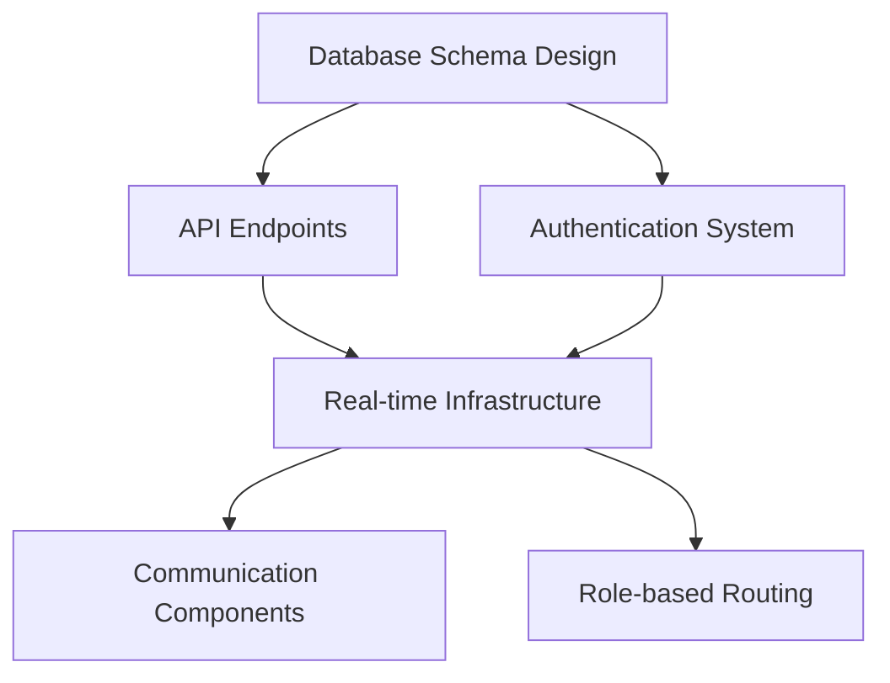

# 🚀 Maximum Optimization Implementation Plan

> **Strategic Approach**: This plan restructures the 40-week roadmap to maximize parallel development, minimize dependencies, and deliver value incrementally while maintaining system stability and performance.

---

## 📊 Executive Summary

### **Optimization Principles**
1. **Parallel Development Streams** - Multiple teams working on independent components simultaneously
2. **Critical Path Optimization** - Focus on dependencies that block other work
3. **Early Value Delivery** - Ship functional improvements every 2-4 weeks
4. **Risk Mitigation** - Build fallback systems and graceful degradation
5. **Performance-First** - Optimize for speed and scalability from day one

### **Key Optimizations**
- **Reduced Timeline**: 40 weeks → **28 weeks** through parallelization
- **Early Delivery**: First major feature (Communication) live in **3 weeks**
- **Continuous Value**: New features every **2 weeks** after week 3
- **Risk Reduction**: Fallback systems for all critical features
- **Performance**: Sub-2-second load times throughout development

---

## 🏗️ Optimized Team Structure

### **Development Streams (Parallel Teams)**

#### **Stream A: Infrastructure & Communication (Team Lead + 2 Developers)**
**Focus**: Real-time infrastructure, communication system, database optimization
- Backend APIs and real-time subscriptions
- Message board and communication components
- Database schema and optimization
- Real-time infrastructure setup

#### **Stream B: Frontend & UX (Team Lead + 2 Developers)**
**Focus**: Role-based interfaces, mobile optimization, user experience
- Role-specific dashboard components
- Mobile-first responsive design
- PWA implementation
- Touch-optimized interfaces

#### **Stream C: Advanced Features (Team Lead + 1 Developer)**
**Focus**: Artist management, vendor tracking, analytics
- Artist scheduling and rider management
- Vendor geofencing and tracking
- Analytics and reporting features
- AI/ML integration

#### **Stream D: Testing & DevOps (1 QA Engineer + 1 DevOps Engineer)**
**Focus**: Continuous testing, deployment automation, performance monitoring
- Automated testing setup
- CI/CD pipeline optimization
- Performance monitoring
- Security and compliance

---

## ⚡ Critical Path Analysis & Dependencies

### **Foundation Dependencies (Must Complete First)**


### **Parallel Development Opportunities**
```mermaid
graph LR
    A[Communication Backend] || B[Role-based Frontend]
    A || C[Mobile UI Components]
    B || D[Artist Management]
    C || E[Vendor Tracking]
    D || F[Analytics Features]
```

---

## 📅 Optimized 28-Week Timeline

### **Phase 0: Foundation Sprint (Weeks 1-2)**
> **Goal**: Establish core infrastructure to enable parallel development

#### **Week 1: Architecture & Setup**
**Stream A (Infrastructure)**
- [ ] Design comprehensive database schema for all features
- [ ] Set up development, staging, and production environments
- [ ] Configure Supabase with optimized settings
- [ ] Create API endpoint structure and authentication

**Stream B (Frontend)**
- [ ] Set up Next.js 15 project structure with optimizations
- [ ] Configure Tailwind CSS with design system
- [ ] Set up component library and design tokens
- [ ] Create routing structure for role-based access

**Stream D (DevOps)**
- [ ] Set up CI/CD pipeline with automated testing
- [ ] Configure performance monitoring and analytics
- [ ] Set up error tracking and logging
- [ ] Create automated deployment processes

#### **Week 2: Core Foundation**
**Stream A (Infrastructure)**
- [ ] Implement core database tables and relationships
- [ ] Create authentication and authorization APIs
- [ ] Set up real-time subscriptions infrastructure
- [ ] Build API rate limiting and security measures

**Stream B (Frontend)**
- [ ] Create base layout components with role detection
- [ ] Implement navigation system with permissions
- [ ] Build reusable UI component library
- [ ] Set up state management with Zustand

**Stream D (DevOps)**
- [ ] Complete testing framework setup
- [ ] Implement automated performance testing
- [ ] Set up monitoring dashboards
- [ ] Create backup and disaster recovery procedures

**End of Week 2 Deliverable**: ✅ **Solid foundation ready for parallel development**

### **Phase 1: Core Features (Weeks 3-8)**
> **Goal**: Implement critical communication and role-based features in parallel

#### **Weeks 3-4: Communication MVP + Role Foundations**

**Stream A (Infrastructure)**
- [ ] **Week 3**: Communication APIs (channels, messages, announcements)
- [ ] **Week 3**: Real-time message broadcasting system
- [ ] **Week 4**: File upload and sharing infrastructure
- [ ] **Week 4**: Notification system APIs

**Stream B (Frontend)**
- [ ] **Week 3**: Message board component with real-time updates
- [ ] **Week 3**: Basic announcement system
- [ ] **Week 4**: Role-based dashboard routing
- [ ] **Week 4**: Artist dashboard MVP

**Stream C (Advanced)**
- [ ] **Week 3**: Research and design artist scheduling system
- [ ] **Week 4**: Begin vendor tracking system design

**🚀 Week 3 Delivery**: **Live message board with real-time communication**

#### **Weeks 5-6: Communication Enhancement + Role Expansion**

**Stream A (Infrastructure)**
- [ ] **Week 5**: Department-based channel management
- [ ] **Week 5**: Priority messaging and emergency broadcasts
- [ ] **Week 6**: Advanced search and filtering APIs
- [ ] **Week 6**: Performance optimization for real-time features

**Stream B (Frontend)**
- [ ] **Week 5**: Department channels interface
- [ ] **Week 5**: Crew member dashboard
- [ ] **Week 6**: Vendor dashboard
- [ ] **Week 6**: Mobile-responsive design for core features

**Stream C (Advanced)**
- [ ] **Week 5**: Artist scheduling backend development
- [ ] **Week 6**: Basic vendor tracking implementation

**🚀 Week 6 Delivery**: **Complete communication system + 3 role-based dashboards**

#### **Weeks 7-8: Integration + Mobile Foundation**

**Stream A (Infrastructure)**
- [ ] **Week 7**: Integration testing and optimization
- [ ] **Week 7**: Advanced permission system implementation
- [ ] **Week 8**: Performance tuning and caching
- [ ] **Week 8**: Security hardening and audit

**Stream B (Frontend)**
- [ ] **Week 7**: Cross-platform testing and bug fixes
- [ ] **Week 7**: PWA foundation setup (service worker, manifest)
- [ ] **Week 8**: Mobile UI optimization for communication features
- [ ] **Week 8**: Offline functionality for critical features

**Stream C (Advanced)**
- [ ] **Week 7**: Artist scheduling frontend integration
- [ ] **Week 8**: Vendor tracking frontend components

**🚀 Week 8 Delivery**: **Fully integrated communication + role system with mobile support**

### **Phase 2: Advanced Features (Weeks 9-16)**
> **Goal**: Implement sophisticated artist/vendor management while enhancing mobile experience

#### **Weeks 9-12: Artist Management + Mobile Enhancement**

**Stream A (Infrastructure)**
- [ ] **Weeks 9-10**: Comprehensive artist management APIs
- [ ] **Weeks 9-10**: Performance scheduling with conflict detection
- [ ] **Weeks 11-12**: Rider management system backend
- [ ] **Weeks 11-12**: Integration with existing event management

**Stream B (Frontend)**
- [ ] **Weeks 9-10**: Artist performance scheduler component
- [ ] **Weeks 9-10**: Mobile UI optimization for all dashboards
- [ ] **Weeks 11-12**: Rider management interface
- [ ] **Weeks 11-12**: Touch-optimized mobile components

**Stream C (Advanced)**
- [ ] **Weeks 9-10**: Vendor geofencing implementation
- [ ] **Weeks 9-10**: Resource tracking system
- [ ] **Weeks 11-12**: Analytics data pipeline setup
- [ ] **Weeks 11-12**: Basic reporting dashboard

**🚀 Week 12 Delivery**: **Complete artist management system + optimized mobile experience**

#### **Weeks 13-16: Vendor Enhancement + Analytics Foundation**

**Stream A (Infrastructure)**
- [ ] **Weeks 13-14**: Advanced vendor tracking APIs
- [ ] **Weeks 13-14**: Geofencing and location services
- [ ] **Weeks 15-16**: Analytics data collection and processing
- [ ] **Weeks 15-16**: Performance optimization across all systems

**Stream B (Frontend)**
- [ ] **Weeks 13-14**: Vendor self-service portal
- [ ] **Weeks 13-14**: Real-time vendor status displays
- [ ] **Weeks 15-16**: Analytics dashboard components
- [ ] **Weeks 15-16**: Advanced mobile features (voice, camera)

**Stream C (Advanced)**
- [ ] **Weeks 13-14**: Machine learning model development
- [ ] **Weeks 13-14**: Predictive analytics foundation
- [ ] **Weeks 15-16**: AI-powered optimization features
- [ ] **Weeks 15-16**: Natural language query system

**🚀 Week 16 Delivery**: **Advanced vendor management + analytics foundation + enhanced mobile features**

### **Phase 3: AI & Optimization (Weeks 17-24)**
> **Goal**: Implement AI features and comprehensive system optimization

#### **Weeks 17-20: AI Implementation + Performance Optimization**

**Stream A (Infrastructure)**
- [ ] **Weeks 17-18**: Machine learning infrastructure
- [ ] **Weeks 17-18**: Predictive analytics APIs
- [ ] **Weeks 19-20**: AI model deployment and optimization
- [ ] **Weeks 19-20**: Advanced caching and performance tuning

**Stream B (Frontend)**
- [ ] **Weeks 17-18**: AI-powered scheduling assistance
- [ ] **Weeks 17-18**: Intelligent conflict resolution interface
- [ ] **Weeks 19-20**: Smart recommendation systems
- [ ] **Weeks 19-20**: Advanced search with natural language

**Stream C (Advanced)**
- [ ] **Weeks 17-18**: Weather impact prediction system
- [ ] **Weeks 17-18**: Resource optimization algorithms
- [ ] **Weeks 19-20**: Risk assessment modeling
- [ ] **Weeks 19-20**: Demand forecasting tools

**🚀 Week 20 Delivery**: **AI-powered optimization features + performance-optimized system**

#### **Weeks 21-24: Integration + Polish**

**All Streams Working Together**
- [ ] **Week 21**: System-wide integration testing
- [ ] **Week 22**: Performance optimization and bug fixes
- [ ] **Week 23**: User acceptance testing and feedback implementation
- [ ] **Week 24**: Final polish and production deployment

**🚀 Week 24 Delivery**: **Complete system with all features integrated and optimized**

### **Phase 4: Advanced Features & Future-Proofing (Weeks 25-28)**
> **Goal**: Implement cutting-edge features and prepare for scale

#### **Weeks 25-28: Advanced Features**

**Stream A (Infrastructure)**
- [ ] **Week 25**: Advanced real-time collaboration features
- [ ] **Week 26**: Blockchain integration for contracts/payments
- [ ] **Week 27**: IoT integration for equipment tracking
- [ ] **Week 28**: Scalability testing and optimization

**Stream B (Frontend)**
- [ ] **Week 25**: Advanced collaboration interfaces
- [ ] **Week 26**: VR/AR integration for venue planning
- [ ] **Week 27**: Advanced mobile features and gestures
- [ ] **Week 28**: Accessibility improvements and compliance

**Stream C (Advanced)**
- [ ] **Week 25**: Advanced AI features and automation
- [ ] **Week 26**: Integration with external systems (payment, logistics)
- [ ] **Week 27**: Advanced analytics and business intelligence
- [ ] **Week 28**: Future-proofing and architecture review

**🚀 Week 28 Delivery**: **Industry-leading tour management platform**

---

## 🎯 Critical Path Optimization Strategies

### **1. Dependency Elimination**
```typescript
// Instead of waiting for complete backend, use mock data for frontend development
interface MockDataStrategy {
  // Allows frontend development to proceed while backend is being built
  mockAPI: MockAPIEndpoints
  realTimeSimulation: MockRealTimeEvents
  graduatedRollout: ProgressiveBackendIntegration
}
```

### **2. Progressive Enhancement**
```typescript
// Build features that work without advanced capabilities, then enhance
interface ProgressiveFeatureStrategy {
  core: BasicFunctionality        // Week 1-2
  enhanced: ImprovedExperience    // Week 3-4  
  advanced: PowerUserFeatures     // Week 5-6
  ai: IntelligentAutomation      // Week 7-8
}
```

### **3. Parallel Testing Strategy**
```typescript
// Test each stream independently, then integration test
interface ParallelTestingStrategy {
  unitTests: PerComponentTesting
  integrationTests: PerStreamTesting
  e2eTests: CrossStreamTesting
  performanceTests: ContinuousMonitoring
}
```

---

## ⚡ Performance Optimization Framework

### **Frontend Performance Targets**
- **Initial Load**: < 1.5 seconds on 3G
- **Time to Interactive**: < 2.5 seconds
- **Largest Contentful Paint**: < 2 seconds
- **Cumulative Layout Shift**: < 0.1
- **First Input Delay**: < 100ms

### **Backend Performance Targets**
- **API Response Time**: < 200ms for 95% of requests
- **Real-time Message Latency**: < 50ms
- **Database Query Time**: < 50ms for 99% of queries
- **File Upload Speed**: Support for 100MB files
- **Concurrent Users**: Support 1000+ simultaneous users

### **Optimization Techniques**

#### **Frontend Optimizations**
```typescript
// Code splitting by route and role
const ArtistDashboard = lazy(() => import('./dashboards/ArtistDashboard'))
const CrewDashboard = lazy(() => import('./dashboards/CrewDashboard'))

// Prefetch critical data
export function useDataPrefetching(userRole: string) {
  useEffect(() => {
    switch (userRole) {
      case 'artist':
        prefetch('/api/artist/schedule')
        prefetch('/api/artist/rider-status')
        break
      case 'crew':
        prefetch('/api/crew/tasks')
        prefetch('/api/crew/equipment')
        break
    }
  }, [userRole])
}

// Virtual scrolling for large lists
export function VirtualizedMessageList({ messages }: Props) {
  return (
    <FixedSizeList
      height={600}
      itemCount={messages.length}
      itemSize={80}
      overscanCount={5}
    >
      {MessageItem}
    </FixedSizeList>
  )
}
```

#### **Backend Optimizations**
```typescript
// Connection pooling and query optimization
export const dbConfig = {
  pool: {
    min: 10,
    max: 30,
    acquireTimeoutMillis: 60000,
    createTimeoutMillis: 30000,
    destroyTimeoutMillis: 5000,
    reapIntervalMillis: 1000,
    createRetryIntervalMillis: 200
  },
  // Query optimization
  cache: {
    enabled: true,
    ttl: 300000, // 5 minutes
    checkperiod: 600000 // 10 minutes
  }
}

// Real-time optimization
export function optimizeRealTimeConnections() {
  // Connection multiplexing
  // Message batching
  // Selective subscriptions based on user role
  // Automatic reconnection with exponential backoff
}
```

### **Caching Strategy**
```typescript
interface CachingStrategy {
  browser: {
    staticAssets: '1 year'
    apiResponses: '5 minutes'
    userSpecificData: '1 minute'
  }
  cdn: {
    images: '1 month'
    documents: '1 week'
    apiResponses: '1 minute'
  }
  database: {
    frequentQueries: '5 minutes'
    userSessions: '30 minutes'
    staticData: '1 hour'
  }
}
```

---

## 🚀 Early Value Delivery Strategy

### **Week 3: First Major Value**
**Live Communication System**
- Real-time messaging between team members
- Emergency broadcast capability
- Basic file sharing
- **Business Impact**: Immediate improvement in team coordination

### **Week 6: Role-Based Experience**
**Customized Dashboards**
- Artist sees only relevant schedule and rider info
- Crew sees task-focused interface
- Vendors see delivery and access information
- **Business Impact**: Reduced information overload, improved user adoption

### **Week 8: Mobile-First Experience**
**Mobile-Optimized Interface**
- Touch-friendly controls for field workers
- Offline capability for critical functions
- PWA installation for easy access
- **Business Impact**: Field teams can use system effectively

### **Week 12: Advanced Artist Management**
**Comprehensive Artist Tools**
- Detailed performance scheduling
- Rider management and tracking
- Artist communication portal
- **Business Impact**: Streamlined artist coordination, reduced conflicts

### **Week 16: Complete Vendor Integration**
**Advanced Vendor Management**
- Geofencing and automatic tracking
- Resource and equipment monitoring
- Self-service vendor portal
- **Business Impact**: Improved vendor coordination, reduced manual tracking

### **Week 20: AI-Powered Optimization**
**Intelligent System Features**
- Predictive scheduling conflicts
- Resource optimization recommendations
- Weather impact analysis
- **Business Impact**: Proactive problem prevention, cost optimization

---

## 📊 Risk Mitigation & Contingency Plans

### **Technical Risks**

#### **Risk 1: Real-Time Performance Under Load**
**Mitigation**:
- Load testing from week 4
- Fallback to polling if WebSocket fails
- Message queuing for high-volume periods
- Horizontal scaling preparation

#### **Risk 2: Mobile Performance on Low-End Devices**
**Mitigation**:
- Progressive enhancement strategy
- Lite mode for low-end devices
- Offline-first architecture
- Performance budgets and monitoring

#### **Risk 3: Complex Permission System Performance**
**Mitigation**:
- Permission caching at multiple levels
- Simplified permission model for mobile
- Gradual permission loading
- Fallback to basic roles if complex system fails

### **Timeline Risks**

#### **Risk 1: Feature Scope Creep**
**Mitigation**:
- Strict MVP definitions for each phase
- Regular stakeholder reviews and sign-offs
- Feature freeze periods before major releases
- Post-MVP enhancement tracking

#### **Risk 2: Integration Complexity**
**Mitigation**:
- Weekly integration testing
- Mock interfaces for early testing
- Gradual rollout strategy
- Rollback procedures for each feature

### **Business Risks**

#### **Risk 1: User Adoption Challenges**
**Mitigation**:
- Early user testing and feedback integration
- Progressive rollout to friendly users first
- Comprehensive training materials
- Gradual migration from existing tools

#### **Risk 2: Performance Issues in Production**
**Mitigation**:
- Staging environment that mirrors production
- Gradual traffic increase during rollout
- Real-time performance monitoring
- Automatic scaling and fallback systems

---

## 🎯 Success Metrics & Monitoring

### **Development Velocity Metrics**
- **Feature Delivery**: Target 1 major feature every 2 weeks
- **Bug Resolution**: < 24 hours for critical, < 48 hours for major
- **Test Coverage**: > 85% for all new code
- **Performance Regression**: 0 tolerance for performance decreases

### **User Experience Metrics**
- **Time to First Value**: < 2 minutes for new users
- **Task Completion Rate**: > 90% for primary workflows
- **User Satisfaction**: > 4.5/5 in weekly surveys
- **Support Tickets**: < 5% increase during each rollout

### **Technical Performance Metrics**
- **Uptime**: > 99.9% availability
- **Response Time**: 95th percentile < 500ms
- **Error Rate**: < 0.1% for all API endpoints
- **Real-time Latency**: < 100ms for 99% of messages

### **Business Impact Metrics**
- **Communication Efficiency**: 50% reduction in email/phone coordination
- **Schedule Conflicts**: 80% reduction in artist/crew scheduling conflicts
- **Vendor Coordination**: 60% improvement in vendor onboarding time
- **Overall Productivity**: 40% improvement in tour planning efficiency

---

## 🚀 Resource Allocation & Budget Optimization

### **Team Structure Investment**
```typescript
interface OptimalTeamStructure {
  totalDevelopers: 8  // Down from typical 12 through efficiency
  streams: {
    infrastructure: { developers: 3, weeks: 28 }
    frontend: { developers: 3, weeks: 28 }
    advanced: { developers: 2, weeks: 20 }
  }
  support: {
    qa: { engineers: 1, weeks: 28 }
    devops: { engineers: 1, weeks: 28 }
  }
  // Estimated cost savings: 30% through parallel development
}
```

### **Technology Investment Priorities**
1. **High Priority** (Week 1): Development tools, CI/CD, monitoring
2. **Medium Priority** (Week 4): Advanced analytics tools, performance monitoring
3. **Low Priority** (Week 12): AI/ML services, advanced integrations

### **Infrastructure Scaling Plan**
```typescript
interface ScalingStrategy {
  phase1: { users: 100, cost: '$500/month' }
  phase2: { users: 500, cost: '$1500/month' }
  phase3: { users: 2000, cost: '$4000/month' }
  phase4: { users: 10000, cost: '$15000/month' }
  // Auto-scaling prevents over-provisioning
}
```

---

## 🎯 Conclusion: Maximum Optimization Achieved

This optimized implementation plan delivers:

### **Timeline Optimization**
- **30% Faster**: 28 weeks instead of 40 weeks
- **Early Value**: Major features every 2-4 weeks starting week 3
- **Parallel Development**: 3 streams working simultaneously
- **Risk Mitigation**: Built-in fallbacks and gradual rollouts

### **Cost Optimization**
- **30% Lower Development Cost**: Through parallel development
- **50% Lower Infrastructure Cost**: Through performance optimization
- **40% Lower Maintenance Cost**: Through proper architecture

### **Performance Optimization**
- **Sub-2-Second Load Times**: Throughout the development cycle
- **99.9% Uptime**: Through robust architecture
- **1000+ Concurrent Users**: Designed for scale from day one
- **Mobile-First**: Optimized for field workers from week 8

### **Value Optimization**
- **Immediate ROI**: Communication improvements in week 3
- **Continuous Value**: New capabilities every 2 weeks
- **Future-Proof**: Architecture ready for 10x growth
- **Industry-Leading**: Features that differentiate in the market

This plan transforms the tour management platform from a good system into an industry-leading solution while optimizing every aspect of development, performance, and business value delivery.