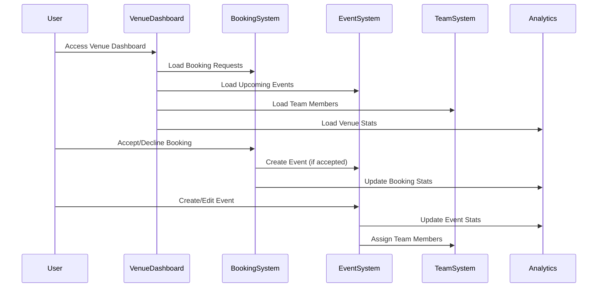
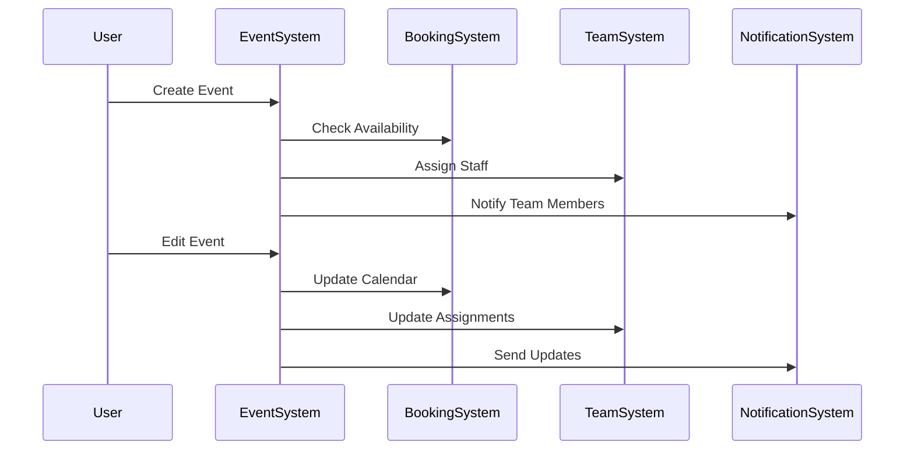
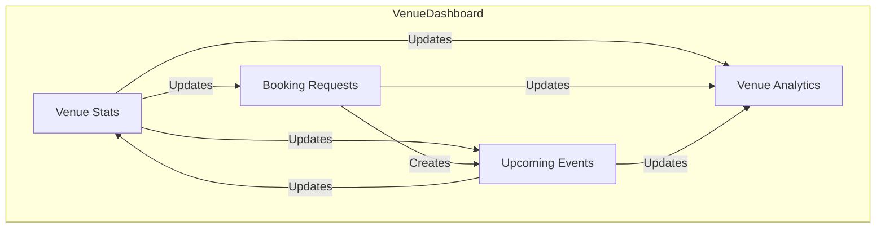
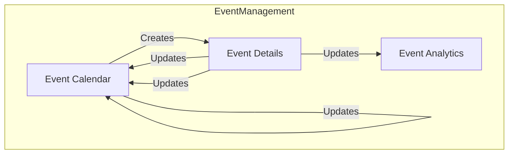

# Tourify Project Structure

## Component Hierarchy and Data Flow

```mermaid
graph TD
    %% Main Application Structure
    App[App Root] --> VenueDashboard[Venue Dashboard]
    App --> MainNav[Main Navigation]
    App --> VenueLayout[Venue Layout]

    %% Venue Dashboard Components
    VenueDashboard --> VenueOwnerSidebar[Venue Owner Sidebar]
    VenueDashboard --> VenueStats[Venue Stats]
    VenueDashboard --> VenueBookingRequests[Booking Requests]
    VenueDashboard --> VenueUpcomingEvents[Upcoming Events]
    VenueDashboard --> VenueDocuments[Documents]
    VenueDashboard --> VenueTeam[Team Management]
    VenueDashboard --> VenueAnalyticsSummary[Analytics Summary]
    VenueDashboard --> VenueCalendar[Calendar]

    %% Navigation Components
    MainNav --> NavItems[Navigation Items]
    NavItems --> Home[Home]
    NavItems --> Dashboard[Dashboard]
    NavItems --> Venues[Venues]
    NavItems --> Events[Events]
    NavItems --> Bookings[Bookings]
    NavItems --> Team[Team]
    NavItems --> Messages[Messages]

    %% Venue Layout Components
    VenueLayout --> VenueSidebar[Venue Sidebar]
    VenueLayout --> MainContent[Main Content]

    %% Modal Components
    VenueDashboard --> EventFormModal[Event Form Modal]
    VenueDashboard --> BookingDetailsModal[Booking Details Modal]
    VenueDashboard --> EventDetailsModal[Event Details Modal]
    VenueDashboard --> EditEventModal[Edit Event Modal]
    VenueDashboard --> EditProfileModal[Edit Profile Modal]

    %% Data Flow
    VenueDashboard --> VenueData[Venue Data]
    VenueData --> MockData[Mock Venue Data]
    VenueData --> API[API Integration]

    %% Styling
    classDef primary fill:#4a90e2,stroke:#2171c7,color:white
    classDef secondary fill:#6c757d,stroke:#495057,color:white
    classDef tertiary fill:#28a745,stroke:#1e7e34,color:white

    class App,VenueDashboard primary
    class MainNav,VenueLayout secondary
    class VenueData,API tertiary
```



## Key Features and Components

### Main Navigation
- Home
- Dashboard
- Venues
- Events
- Bookings
- Team
- Messages
- Equipment
- Finances

### Venue Dashboard Features
1. **Overview**
   - Venue Stats
   - Booking Requests
   - Upcoming Events
   - Quick Actions

2. **Management**
   - Event Management
   - Booking Management
   - Team Management
   - Document Management

3. **Analytics**
   - Event Analytics
   - Financial Reports
   - Audience Insights

4. **Modals**
   - Event Form
   - Booking Details
   - Event Details
   - Edit Event
   - Edit Profile

## Data Flow
1. Venue data is loaded from mock data (to be replaced with API)
2. Components receive data through props
3. State management for user interactions
4. Modal components for data entry and editing

## Component Dependencies
- Uses Next.js for routing
- Implements React hooks for state management
- Utilizes UI components from a custom component library
- Integrates with various icons from Lucide
- Implements responsive design patterns 

## Page Navigation and Routing Flow

```mermaid
flowchart TD
    %% Main Routes
    Home[Home Page /] --> Dashboard[Dashboard /dashboard]
    Home --> Venues[Venues /venues]
    Home --> Events[Events /events]
    Home --> Music[Music /music]
    Home --> Network[Network /network]
    Home --> Messages[Messages /messages]
    Home --> Bookings[Bookings /bookings]
    Home --> Teams[Teams /teams]

    %% Venue Routes
    Venues --> VenueDashboard[Venue Dashboard /venue]
    VenueDashboard --> VenueEvents[Venue Events /venue/events]
    VenueDashboard --> VenueBookings[Venue Bookings /venue/bookings]
    VenueDashboard --> VenueTeam[Venue Team /venue/team]
    VenueDashboard --> VenueAnalytics[Venue Analytics /venue/analytics]
    VenueDashboard --> VenueDocuments[Venue Documents /venue/documents]
    VenueDashboard --> VenueSettings[Venue Settings /venue/settings]

    %% Event Routes
    Events --> EventCreate[Create Event /events/create]
    Events --> EventDetails[Event Details /events/[id]]
    EventDetails --> EventEdit[Edit Event /events/[id]/edit]
    EventDetails --> EventAnalytics[Event Analytics /events/[id]/analytics]

    %% Booking Routes
    Bookings --> BookingRequests[Booking Requests /bookings/requests]
    Bookings --> BookingCalendar[Booking Calendar /bookings/calendar]
    Bookings --> BookingSettings[Booking Settings /bookings/settings]

    %% Team Routes
    Teams --> TeamMembers[Team Members /teams/members]
    Teams --> TeamRoles[Team Roles /teams/roles]
    Teams --> TeamPermissions[Team Permissions /teams/permissions]

    %% Content Routes
    Content[Content /content] --> Posts[Posts /content/posts]
    Content --> Photos[Photos /content/photos]
    Content --> Videos[Videos /content/videos]
    Content --> EPK[EPK /epk]

    %% Venue & Events Routes
    VenuesEvents[Venues & Events] --> VenuesMap[Venues Map /venues/map]
    VenuesEvents --> Equipment[Equipment /equipment]
    VenuesEvents --> Tickets[Tickets /tickets]

    %% Business Routes
    Business[Business] --> Finances[Finances /finances]
    Business --> Reports[Reports /reports]
    Business --> Marketing[Marketing /marketing]

    %% Component Access
    subgraph Components
        direction TB
        VenueStats[Venue Stats]
        BookingRequests[Booking Requests]
        UpcomingEvents[Upcoming Events]
        VenueDocuments[Documents]
        VenueTeam[Team Management]
        VenueAnalytics[Analytics]
        VenueCalendar[Calendar]
    end

    %% Component Access Rules
    VenueDashboard --> Components
    VenueEvents --> UpcomingEvents
    VenueBookings --> BookingRequests
    VenueBookings --> VenueCalendar
    VenueAnalytics --> VenueStats
    VenueAnalytics --> VenueAnalytics

    %% Styling
    classDef page fill:#4a90e2,stroke:#2171c7,color:white
    classDef component fill:#28a745,stroke:#1e7e34,color:white
    classDef section fill:#6c757d,stroke:#495057,color:white

    class Home,Dashboard,Venues,Events,Music,Network,Messages,Bookings,Teams page
    class VenueStats,BookingRequests,UpcomingEvents,VenueDocuments,VenueTeam,VenueAnalytics,VenueCalendar component
    class Content,VenuesEvents,Business section
```

## Page Navigation Details

### Main Routes
- **Home** (`/`)
  - Entry point to all main sections
  - Quick access to dashboard and key features

- **Dashboard** (`/dashboard`)
  - Overview of all venue activities
  - Quick stats and recent updates

- **Venues** (`/venues`)
  - Venue management hub
  - Access to venue-specific features

### Venue Management
- **Venue Dashboard** (`/venue`)
  - Central hub for venue operations
  - Access to all venue-specific features

- **Venue Events** (`/venue/events`)
  - Event management
  - Calendar view
  - Event creation and editing

- **Venue Bookings** (`/venue/bookings`)
  - Booking management
  - Request handling
  - Calendar integration

### Event Management
- **Events** (`/events`)
  - Event listing
  - Creation and management
  - Analytics and reporting

- **Event Details** (`/events/[id]`)
  - Detailed event information
  - Edit capabilities
  - Analytics and reporting

### Team Management
- **Teams** (`/teams`)
  - Team member management
  - Role assignment
  - Permission settings

### Content Management
- **Content** (`/content`)
  - Posts, photos, and videos
  - EPK management
  - Media library

### Business Operations
- **Business**
  - Financial management
  - Reporting
  - Marketing tools

## Component Accessibility

### Venue Dashboard Components
- Venue Stats
- Booking Requests
- Upcoming Events
- Documents
- Team Management
- Analytics
- Calendar

### Event Management Components
- Event Creation Form
- Event Details View
- Event Calendar
- Event Analytics

### Booking Management Components
- Booking Request Form
- Booking Calendar
- Request Management
- Settings Panel

## Navigation Rules
1. All main sections are accessible from the home page
2. Venue-specific features require venue access
3. Team management requires appropriate permissions
4. Business features require admin access 

## Detailed Feature Workflows

### Venue Management Workflow


### Event Management Workflow


## Component Interactions

### Venue Dashboard Components


### Event Management Components


## Feature Details

### Venue Management
1. **Dashboard Overview**
   - Real-time venue statistics
   - Pending booking requests
   - Upcoming events calendar
   - Team member availability
   - Quick action buttons

2. **Booking Management**
   - Booking request handling
   - Calendar integration
   - Availability checking
   - Automated notifications
   - Booking analytics

3. **Event Management**
   - Event creation and editing
   - Team assignment
   - Resource allocation
   - Event timeline
   - Guest list management

4. **Team Management**
   - Member roles and permissions
   - Schedule management
   - Task assignment
   - Performance tracking
   - Communication tools

### Analytics and Reporting
1. **Venue Analytics**
   - Booking statistics
   - Revenue tracking
   - Event performance
   - Team efficiency
   - Resource utilization

2. **Financial Reports**
   - Revenue analysis
   - Expense tracking
   - Profit margins
   - Budget management
   - Financial forecasting

3. **Audience Insights**
   - Attendance patterns
   - Customer demographics
   - Feedback analysis
   - Market trends
   - Growth opportunities

## Data Models

### Venue Data Structure
```typescript
interface Venue {
  id: string;
  name: string;
  type: string;
  capacity: number;
  location: {
    address: string;
    city: string;
    state: string;
    zip: string;
  };
  amenities: string[];
  contact: {
    name: string;
    email: string;
    phone: string;
  };
  stats: {
    events: number;
    bookings: number;
    rating: number;
    revenue: number;
  };
}
```

### Event Data Structure
```typescript
interface Event {
  id: string;
  title: string;
  description: string;
  date: Date;
  startTime: string;
  endTime: string;
  type: string;
  status: 'scheduled' | 'in-progress' | 'completed' | 'cancelled';
  capacity: number;
  ticketPrice: number;
  isPublic: boolean;
  team: TeamMember[];
  resources: Resource[];
}
```

## Security and Access Control

### User Roles
1. **Admin**
   - Full system access
   - User management
   - System configuration
   - Financial management

2. **Venue Manager**
   - Venue management
   - Booking approval
   - Team management
   - Event management

3. **Team Member**
   - Event participation
   - Task management
   - Communication
   - Basic reporting

4. **Guest**
   - Event viewing
   - Booking requests
   - Basic interaction

### Access Control Matrix
| Feature | Admin | Venue Manager | Team Member | Guest |
|---------|-------|---------------|-------------|--------|
| Venue Management | ✓ | ✓ | - | - |
| Booking Management | ✓ | ✓ | - | - |
| Event Management | ✓ | ✓ | ✓ | - |
| Team Management | ✓ | ✓ | - | - |
| Financial Reports | ✓ | ✓ | - | - |
| Analytics | ✓ | ✓ | ✓ | - |
| User Management | ✓ | - | - | - |

## Integration Points

### External Services
1. **Payment Processing**
   - Stripe integration
   - PayPal integration
   - Invoice generation
   - Payment tracking

2. **Communication**
   - Email notifications
   - SMS alerts
   - Push notifications
   - In-app messaging

3. **Analytics**
   - Google Analytics
   - Custom tracking
   - Performance monitoring
   - Error logging

4. **Storage**
   - File storage
   - Image processing
   - Document management
   - Backup systems

## Performance Considerations

### Optimization Strategies
1. **Data Loading**
   - Lazy loading
   - Pagination
   - Caching
   - Data prefetching

2. **UI Performance**
   - Component memoization
   - Virtual scrolling
   - Image optimization
   - Code splitting

3. **API Optimization**
   - Request batching
   - Response caching
   - Rate limiting
   - Error handling

## Development Guidelines

### Code Organization
1. **Component Structure**
   - Atomic design principles
   - Component composition
   - State management
   - Props validation

2. **Styling Approach**
   - CSS modules
   - Tailwind CSS
   - Responsive design
   - Theme support

3. **Testing Strategy**
   - Unit testing
   - Integration testing
   - E2E testing
   - Performance testing 